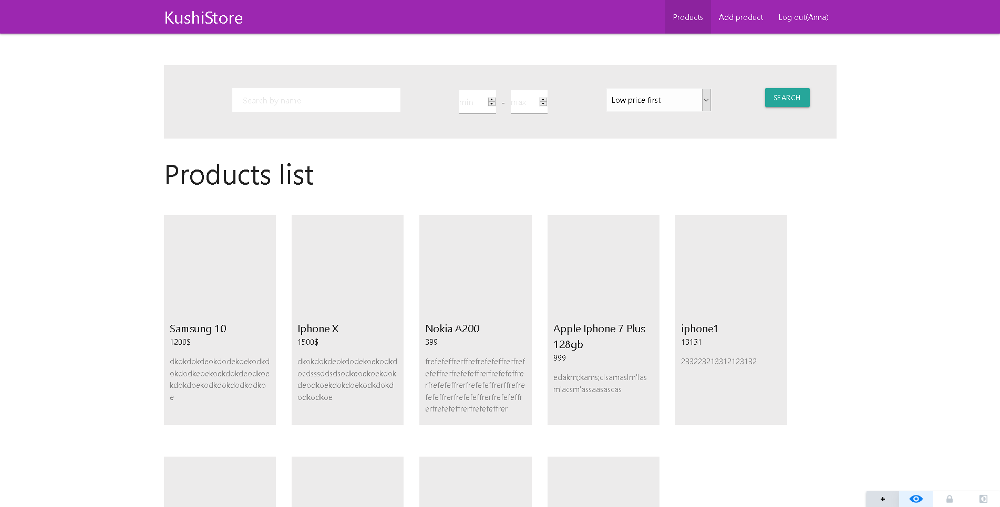

# thinktestapp

To be able run the app

install postgres on your pc, run that

create a database from the psql shell

then open the .env file and fill your data, such as username, user password and database name which you want to ue

then npm install

and npm run start, the app should start :D
